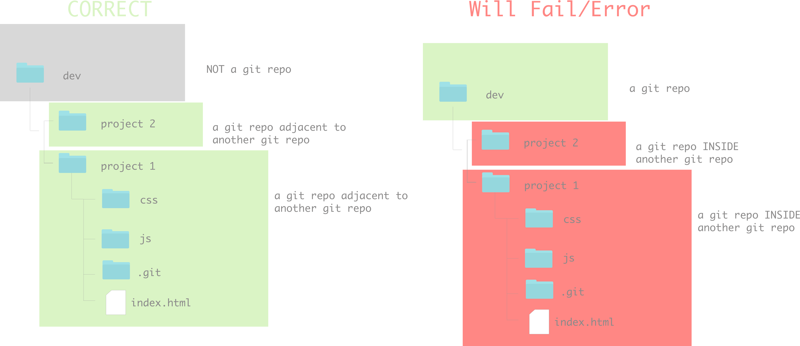

---
Title: Review: git/github, terminal, and anything we've covered so far<br>
Type: Morning Exercise<br>
Modified by: Hunter Wallen<br>
Creator: Karolin Rafalski<br>
Competencies: git and github, terminal, html fundamentals <br>
Prerequisites: None<br>

---

# Git/Github Review - Confirm Success with Submitting HW


Let's take some time to make sure we all learn how to submit homework correctly.

### Each of you will interact with three copies of the homework:
1. The instructor version
    - accessible to you on github. The github version is known as the 'remote' version or 'on/in the cloud' or 'on the internet'
      - you can look at the repo in the browser by going to the url: `https://git.generalassemb.ly/SEI-Synchrony-11-22/hw1-unix-commands`
      - you can get the contents onto your computer (local version) by
        first forking that assignment making a personal copy THEN cloning from the forked repository.
        - `git clone <link here>` clone the forked repository (YOUR PERSONAL COPY) to your local machine.
        - `main` is the name of the branch. `main` is the default name of the first branch created. We will learn about branches later. For now, we'll only work with main.
2. Your remote version 
     - accessible to you on github by going to the url
     - you can look at the repo in the browser on github
     - you can get contents onto your computer (local version) by
     - `git clone <link here>` clone the forked repository (YOUR PERSONAL COPY) to your local machine.
3. Your local version
     - accessible to you from your computer. This is the copy that 'lives' on your hard drive.
     - it does NOT automatically sync. You have to tell it to sync with the remote versions. This is a good thing.
     - you can send your version to your fork on github (origin). If you try, you'll get an error. Make sure that your url is set to your remote repository and not the one your forked from using `git remote set-url origin <git@hostname:USERNAME/REPOSITORY.git>` if you do not have a remote url set use this command `git remote add origin <git@hostname:USERNAME/REPOSITORY.git>`.


###  Daily workflow:

- `git status` - see the current state of your files

- `git add .` or `git add -A` (they both do the same thing) - select the files you want to track/save to github (called `staging`)
    - you may not always want to add all of your files all the time.
    - the command `git add .` or `git add -A` specifies 'all the files and folders in this directory' - so anything at this level and below. It will not select files that are in a higher directory
    - if you want to get files that are elsewhere, the easiest thing to do is to navigate to that place and use the above command

- `git commit -m 'some informative message'` - this is the command to make a `snapshot` of your file (saves the current version)

- `git push origin main` - this sends your work to your remote copy of the class repo

- Homework submission: create a pull request in github from your forked repository to the origin source repository. Don't forget to fill out the pull request template! 


### Common Errors and how to solve them


---
**Command:**
- `git status`

 **Error:**
 - `fatal: Not a git repository (or any of the parent directories) `

 **What does it mean?**

 - You are not in the correct directory in terminal

 **Fix**

 - navigate to the correct location on Terminal

 ---

 **Command:**
 - `git push origin main`

  **Error:**
  ```![rejected  main -> main (fetch first)]
  error: failed to push some refs to 'https://github.com/...'
  ...
   ```

   **What does it mean?**

   - Your remote version has more recent updates. You must pull them and merge them before you can push your latest changes
   - Important: Terminal may open Vim - remember to quit Vim - you must type `:wq` - the reason it opens Vim is so you can have a chance to write a descriptive comment about the merge. Keep it simple! In this class, you don't have to worry about writing a note about the merge.
   - Important: failing to exit Vim correctly can cause errors and you will have to start typing the commands again to finish

   **Fix**

   - `git pull origin main`
   - `:wq` if you are in Vim

---

  **Command:**
  - `git status`

   **Error:**


```
   On branch main
   Your branch is up-to-date with 'origin/main'.
   Untracked files:
      list_of_files
    Nothing added to commit but untracked files present (use "git add" to track)

```

   **What does it mean?**

   - Your files are not being tracked

   **Fix**

   - `git add .` or `git add -A`

---

### Converting a git repository back to a regular directory

- When you run `git init` it creates a hidden directory called `.git`
- You can only see this folder when you run `ls -a` , you won't see it if you just run `ls`, additionally, Finder's default is to not show hidden files
- `.git` is updated automatically and you should never make changes in there
- if you no longer want a directory to be tracked by git, you can delete the entire `.git` folder, then when you type `git status` it should then say `fatal: Not a git repository (or any of the parent directories) `

**DANGER ZONE** to remove `.git` , go into the directory where the wrong `.git` is and type `rm -rf .git`

**Use extreme caution** `rm -rf` is a very dangerous command that can irreversibly delete anything on your computer, so make sure to specify the exact directory you want to delete


### One More Gotcha!

GOTCHA: Do not initialize a git repository inside of another git repository, do not make your root directory of your computer a git repository - this will confuse git and you won't be able to track or even open your files on github. Additionally, making your entire computer a git repository can significantly slow down your entire computer.




#### Ask Yourself:
1) How many repos can you have on github?
2) How many repos can you have on your computer?
3) Can you put a git repo inside another repo?
4) Should you make your whole computer a git repo?

## Part 2
#### Any Questions About Submitting Homework?

If you had any questions about how to submit your homework, ask! We're here to help clarify.
