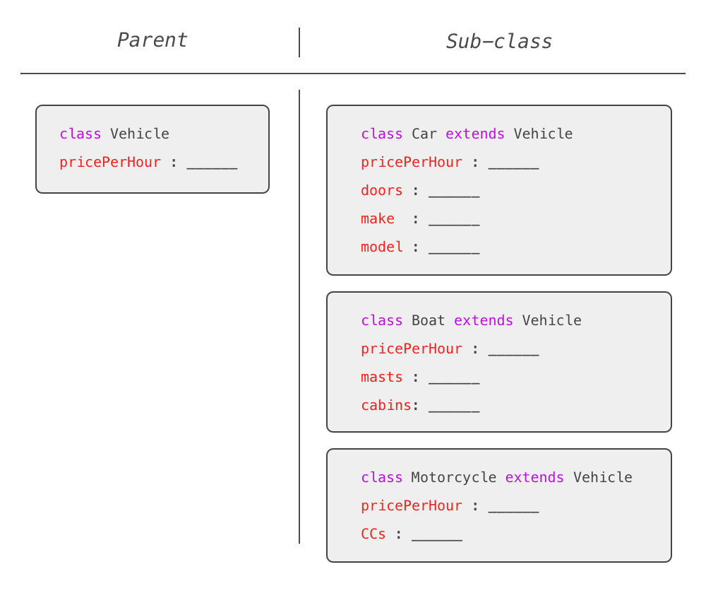

[](https://generalassemb.ly/education/web-development-immersive)

# Object-Oriented Programming in JavaScript

## Learning Objectives

-   Use a constructor function to produce objects of a particular type.
-   Refactor prototypes using ES6 class syntax
-   Use the `new` keyword to create instances of a class or prototype
-   Define and put inheritance into practice

## Object Oriented Programming

Object oriented programming (OOP) isn't a language or a tool. OOP is a style of programming — what we call a **programming paradigm**.  The four pillars of object oriented programming are:

<details>
  <summary><strong>1. Encapsulation</strong></summary>
  <p>Encapsulation is one method that we use to try to make complex systems easier to use.  Encapsulation is defined as the action of enclosing something in, or as if in, a capsule.  In programming, the capsule is an object.  This makes our code clearer and cleaner because all of the related parts are grouped together!</p>
  <p>We also use encapsulation to hide all of the really complex parts of our code, while providing simple ways to access the essential parts from the outside only when necessary.  This means we can isolate the impact of changes in the internal, hidden parts has on the overall system.</p>
</details>
<details>
  <summary><strong>2. Abstraction</strong></summary>
  <p> Abstraction is a concept that is closely related to encapsulation.  It's also a way to remove complexity.  Think of your phone.  It's got a pretty simple user Interface: maybe it has a screen and one button (maybe not even a button!), but the internal logic board of the phone is super complicated.  As a user, we don't need to know anything about how the phone's logic board works in order to use it. This is an example of abstraction in the real world.</p>
  <p>Both abstraction and encapsulation aim to reduce complexity in our code.  Encapsulation refers to the things we do to reduce the complexity in our implementation or how our code is actually written.   Abstraction refers to how we design or architect our code.  Thus abstraction happens when we plan and encapsulation happens when we execute the plan.</p>
</details>
<details>
  <summary><strong>3. Inheritance</strong></summary>
  <p>One of the chief problems with encapsulating all of our code into self contained objects is that there's a strong possibility that we'll have lots of duplicated code among objects of a similar type.  Inheritance helps us solve that problem.</p>
  <p>Let's put this in terms of a real life example too.  Imagine you've got a program with different types of users.  Some users are administrators who can do lots more in our app than customers can. Even though they are different they share a lot in common.  They both have emails, usernames, passwords, profile pictures and much more.</p>
  <p>Using inheritance we can put all of things that users have in common inside of one object called **User** and then create separate objects for an Admin and a Customer.  Both of the Admin and the Customer will **inherit** the properties and behaviors that they share in common from the User.  This helps make our code DRYer.</p>
</details>
<details>
  <summary><strong>4. Polymorphism</strong></summary>
  <p>Poly means many and morph means form, so polymorphism is many forms.  Lets imagine that you have a program with animals (it  could totally happen :smile:). All of the animals have the same method called move.  This method causes the animals to walk to a specific location on the screen.  It works great for some of our animals, but not for the fish or birds in our program.  They need a different type of implementation for moving, they need to swim or fly, not walk.  So the method move can take many forms, depending on the animal type that uses it!</p>
  <p>Polymorphism makes our code easier to understand and work with because it's way less complicated to remember that every animal has a move method, than to remember that the method for a dog is called walk and the one for the catfish is swim, or the one for the pigeon is fly.  It's also clearer to us if each type of animal is responsible for it's own implementation of move than to have a single method called move that uses a gigantic conditional statement to determine how that one method should be applied to different types of animals.</p>
</details>

## JavaScript and OOP

OOP is not a language, it's just a collection of principles that guide how we write and organize our code.  Some languages are considered to be Object Oriented Programming languages though.  These languages treat everything like an object and use classes as a way to define those objects (think of classes like a blueprint for the object).  Languages like Ruby and Python fall into this category.  Some languages, like C-base languages (e.g., C#, C++, Java), are also considered to be object-oriented programming languages even though they don't strictly treat everything like an object.

Then there's JavaScript... this one is a little controversal.  JavaScript doesn't treat everything as an object nor is based on classes.  JavaScript uses prototypes instead of classes.  So is it an object oriented programming language?  Well, that's a question for others to fight over.  What we can say about JavaScript is that we can absolutely write our code in an object-oriented style following the principles of the OOP paradigm.  In fact, this is one of the most popular ways that you'll see JavaScript used in the wild.


Now, let's create `wonderWoman` using something called a [constructor function](https://www.w3schools.com/js/js_object_constructors.asp) instead of an [object literal](https://betterprogramming.pub/object-literal-in-javascript-d3e0e7d58f3b):

```js
// We are using this:
const Hero = function (name, alias, power) {
  this.name = name
  this.alias = alias
  this._power = power
}

const wonderWoman = new Hero('Diana Prince', 'Wonder Woman', 'Deflect bullets with bracelets')

/*
* Instead of this:
* const wonderWoman = {
*   name: 'Diana Prince',
*   alias: 'Wonder Woman',
*   power: 'Deflects bullets with bracelets'
* }
*/

console.log(wonderWoman)
// {
//   name: 'Diana Prince',
//   alias: 'Wonder Woman',
//   power: 'Deflects bullets with bracelets'
// }
```

The `new` keyword in JavaScript does the following, in order:

1. Creates an empty object (`{}`).
1. Attaches the constructor function to the object as a property.
1. Invokes the constructor function as a method on the object.
1. Returns the object.

If we forget to use the `new` keyword what happens is that the context of `this` is not set to the new object!  That means that we'll wind up creating all of our the properties and methods on the global object.  In the browser, that means we'll be adding them to the `window` object.

A new object created this way is sometimes called an 'instance' of type `Hero`.


## Classes in JavaScript

_you_: Wait, you said that there weren't classes in JavaScript...

_me_: There aren't **real** classes in JavaScript.  Classes in JavaScript are just _**syntactic sugar**_.  Syntactic sugar is syntax within a programming language that is designed to make things easier to read or to express. It makes the language "sweeter" for human use.

## Classes in ES6

The syntax to define a class in JavaScript looks like this:


> The above figure shows how to define a simple class using JavaScript. The
> Class is defined using the `class` keyword and given a name (in this case
> `Car`). The `constructor` function accepts three parameters (`make`, `model`,
> and `color`) and sets these as attributes. The class also contains a `drive`
> method.

Notice the use of `this` and the fact that we're not returning from the class?

When we want to generate instances of this class, we'll use the `new` keyword:

```js
const corolla = new Car('Toyota', 'Corolla', 'Silver')
const outback = new Car('Subaru', 'Outback', 'Forest Green')
```

The `new` keyword will automatically:

1. Creates an empty object (`{}`).
1. Attaches the constructor function to the object as a property.
1. Invokes the constructor function as a method on the object.
1. Returns the object.

How is this different from the way that we saw it used with constructors before?

> One nice thing about the class syntax is that you cannot forget to use the `new` keyword because you'll get an error immediately in the console if you do.

### You Do: Define an Animal Class

Define a class for your favorite animal (dog, cat, giraffe, etc).
 - Give your class 3 attributes and an eat method.
 - After you've defined your class, create 3 instances of it.

## Inheritance

One of the core concepts of OOP we need to implement is inheritance.

### Inheritance in JavaScript

In JavaScript, we can inherit from a class by *extending* it with the `extend`
keyword. This will let us create a subclass:

```js
class Car {
  constructor(make, color) {
    this.make = make
    this.color = color
  }
}

class Toyota extends Car {
  drive() {
    console.log('vroom vroom')
  }
}
```

The above `Toyota` class will include all of the properties defined in the `Car`
class, in addition to the `drive` method.

If we have properties that we want to add to our subclass, we still need to take
in the properties of our parent class, and pass them up to our parent class with
`super`:

```js
class Car {
  constructor(model, color) {
    this.model = model
    this.color = color
  }
}

class Toyota extends Car {
  constructor(model, color) {
    super(model, color)

    this.make = 'Toyota'
  }
  drive() {
    console.log('vroom vroom')
  }
}
```

The `super` method invokes the `constructor` method of the parent (or extended)
class. So in our `Toyota` class, the `super` method will call the `constructor`
method of our `Car` class.


### Why using classes is a good idea?
Our `Car` class is relatively simple at the moment. But with time, and as our
application grows, it could become pretty complex. That complexity is hidden
from us (the users of this `Car` class). We can just create new instances of our
`Car` class and have everything we need to work with a car in our application.
This is called encapsulation.

Now imagine we're building the part of the application that lets a user rent one
of our cars. Through the user interface, they swap out one car for another.
Because every object representing a car follows the same template, handling
cases like this is not a problem, it's actually pretty simple! This is called
Modularity.


### How about Inherintace
Inheritance is a key component of the OOP paradigm. We can understand it by
thinking through some new information for our Rent-A-Car scenario:

Lets say our client comes to us and says they've decided to branch out into
renting boats and motorcycles, in addition to cars. A lot of the data for these
three types of vehicles will be the same: they'll all rent for a certain price
per day, for instance. But they'll also have some unique data: a car has doors
(two or four) while a motorcycle and boat do not. How can we capture this in our
application?

One way would be to define 3 separate classes and duplicate any shared
attributes or methods. This is not a good solution though because at some point,
we'll probably need to change something (like maybe we start renting per hour
instead of per day) and we'd need to update all three classes to reflect that
change.

Instead, we'll use the concept of inheritance: we'll create a `Vehicle` class
and define all our shared attributes and methods there. We'll then create three
classes that inherit from that `Vehicle` class (`Car`, `Boat`, and `Motorcycle`
classes). By inheriting from another class, each sub-class will adopt the
attributes and methods of it's parents and can define it's own unique attributes
and methods.



## You Do: Extend an Animal Class

Define and Animal class with the following properties and methods:

-  group (Invertebrates, Fish, Amphibians, Reptiles, Birds, and Mammals)
-  eat: log "yum yum" to the console
-  sleep: log "zzzzz" to the console

Modify your animal from the previous prompt so that it extends your new Animal class.

Create an instance of your animal class (the one that extends the Animal class).

## BONUS: Game of Cards

### Card class
Define a Card class with the following properties:
 - suit
 - rank
 - score

### Deck class
Define a Deck class with the following properties:
 - suits = `['hearts', 'spades', 'clubs', 'diamonds']`
 - ranks = `['Ace', 2, 3, 4, 5, 6, 7,8, 9, 10, 'Jack', 'Queen', 'King']`
 - scores = `[1,2,3,4,5,6,7,7,8,9,10,11,12,13]`
 - cards = `[]`

When you create an instance of your Deck class (i.e. in your constructor), fill in the cards array with 52 instances of your Card class. You can do this with inside the constructor using a nested for loop

first loop through the array of all possible suits, then loop through the array of all possible ranks. Inside your inner loop, create an instance of your Card class and push it into the Deck's cards array.

### Dealer class
Define a Dealer class that will extend the properties of the Deck class and will have the following methods.
 - shuffle - shuffle the cards array in place
 - draw - return a random card from the cards array
 - dealCards -  This method returns an array of two arrays. Each inner array is representing the cards deck for a player and it should be distributed equally (26 cards each).

e.g.


Instantiate an instance of your Dealer class and start drawing, shuffling, dealing Cards.
