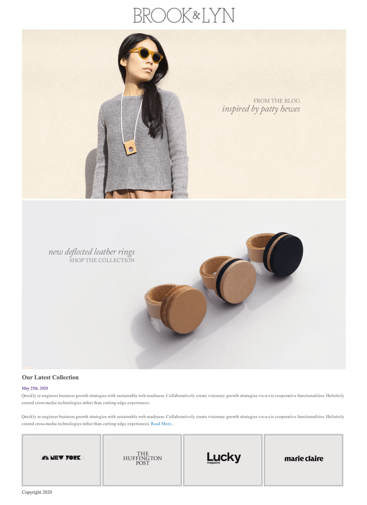

# Brook & Lyn: A layout exercise

This old website of fashion brand Brook & Lyn has a relatively simple layout. For today's morning exercise, it is your goal to recreate it to the best of your ability.

## The Mockup

## Set Up

1. In today's warm_up folder, there's another directory called `brooklyn`. Create an `index.html` and `styles.css` inside that folder and work in there to recreate the mockup. Don't forget to link the two together! 
1. All images you will need are provided in the `brooklyn/imgs` folder 

---

## Hungry for More

If you finish early, consider doing any of the following: 

1. Make the design mobile responsive - it's up to you what that looks like! 
1. Instead of the top two banners being displayed all at once, try holding the images in a carousel instead using some jQuery 
1. Add your own styling, have fun with it! Change the font, the colors, whatever you want and need to practice 
